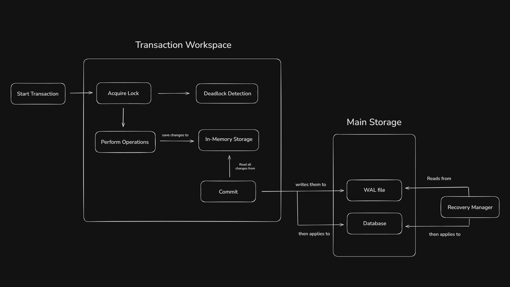

# Transaction Handler

### Repo Structure: main.java.com.mns.tx_manager
- app/App.java -- Entry point
- transaction/Transaction.java -- Transaction workspace
- lockManager/LockManager.java -- manages lock acquisition
- wal/LogEntry.java -- defines Log record model
- wal/WalManager.java -- creates n manages walFile
- storage/InMemoryStorageEngine.java -- implements StorageEngine
- storage/StorageEngine.java -- defines storage interface

## Overview

